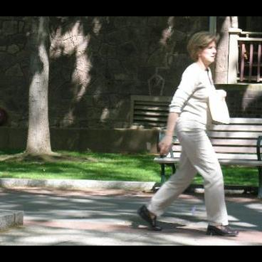
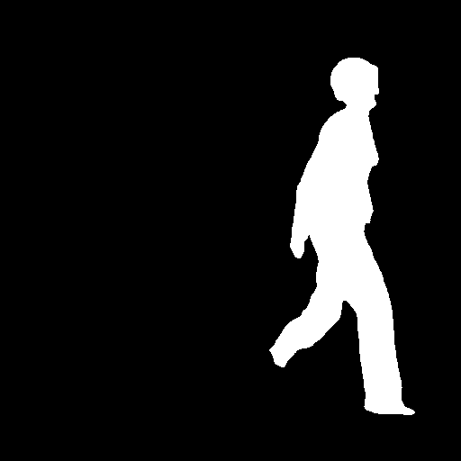

# U-Net PennFudanPed 语义分割实践

这是我第一次完整复现并优化语义分割训练流程的学习项目。项目将原 `Pytorch-UNet` 面向 Carvana 汽车分割的数据流程，适配为基于 `PennFudanPed` 数据集的行人二分类语义分割，并进一步对训练轮数、学习率和优化器进行了对比实验。

> 当前状态：`v0.2`。已完成训练、验证、最佳 checkpoint 保存、单图预测和优化器/学习率对比；当前最佳模型使用 AdamW，17 张验证图片上的 Dice 为 `0.848330`。

## 项目目标

在已有图像分类经验的基础上，完整理解并实践下面这条语义分割链路：

```text
PennFudanPed 原始数据
        ↓
实例 mask 转二值 mask
        ↓
Dataset / DataLoader
        ↓
U-Net forward
        ↓
CrossEntropy + Dice Loss
        ↓
Backward / Optimizer
        ↓
Validation Dice
        ↓
Checkpoint
        ↓
使用自己训练的模型预测
```

本项目只包含两个语义类别：

```text
0：background
1：person
```

模型配置为：

```text
n_channels = 3
n_classes = 2
```

## 主要改动

本项目基于 [milesial/Pytorch-UNet](https://github.com/milesial/Pytorch-UNet) 修改，保留了原项目的 U-Net 结构、Dataset 设计、Dice 实现和核心训练逻辑。主要改动如下：

1. 使用小型 `PennFudanPed` 行人数据集替代体积较大的 Carvana 数据集。
2. 新增 `prepare_pennfudan.py`：
   - 将 PennFudan 的 instance mask 合并为 person 二值 mask；
   - 输出 mask 像素值为 `0/255`；
   - 将不同尺寸的图片和 mask 等比例缩放并 padding 到 `512×512`；
   - 保留原始数据，不在原目录中修改文件。
3. 新增 `check_data.py`，在训练前检查图片与 mask 匹配、shape、dtype、类别值和 DataLoader batch。
4. 新增 `validate.py`，可以独立验证指定 checkpoint。
5. 验证 DataLoader 使用 `drop_last=False`，避免小型验证集丢失最后一个 batch。
6. W&B 改为可选依赖：未安装时仍可正常完成本地训练。
7. 训练日志增加每个 epoch 的平均 loss。
8. 支持通过 `--optimizer` 切换 RMSprop 与 AdamW，并通过 `--run-name` 分别保存实验权重。
9. 固定模型初始化、数据划分和 DataLoader 打乱随机种子，使不同参数实验更可比。
10. 将验证调整为每个 epoch 结束后执行一次，并只保存验证 Dice 最高的模型。
11. 训练 DiceLoss 与验证 Dice 都忽略背景类别，减少背景像素占比过大造成的指标偏差。
12. 修正验证集最后一个不足 batch 的批次权重，并加入 NaN/Inf Loss 检测。

## 项目结构

```text
U-Net-PennFudanPed/
├── unet/
│   ├── __init__.py
│   ├── unet_model.py
│   └── unet_parts.py
├── utils/
│   ├── __init__.py
│   ├── data_loading.py
│   ├── dice_score.py
│   └── utils.py
├── prepare_pennfudan.py
├── check_data.py
├── train.py
├── evaluate.py
├── validate.py
├── predict.py
├── test_images/
│   └── person.png
├── outputs/
│   └── person_adamw_mask.png
├── requirements.txt
├── LICENSE
└── README.md
```

完整数据集和训练权重不会上传到仓库；仅保留 README 使用的一张测试图片和对应预测结果。

## 环境

本次实际运行环境：

```text
Windows
PyTorch 2.7.0+cu118
TorchVision 0.22.0+cu118
CUDA 11.8
NVIDIA GeForce RTX 3060 Laptop GPU
```

建议先根据自己的显卡环境，从 [PyTorch 官网](https://pytorch.org/get-started/locally/) 安装匹配的 PyTorch 和 TorchVision，再安装其余依赖：

```powershell
pip install -r requirements.txt
```

## 1. 下载 PennFudanPed

数据集来自 PyTorch 官方教程使用的 Penn-Fudan 行人检测与分割数据集：

```powershell
Invoke-WebRequest `
  -Uri "https://www.cis.upenn.edu/~jshi/ped_html/PennFudanPed.zip" `
  -OutFile ".\PennFudanPed.zip"

Expand-Archive -LiteralPath ".\PennFudanPed.zip" -DestinationPath "."
```

解压后的原始结构应为：

```text
PennFudanPed/
├── PNGImages/
└── PedMasks/
```

## 2. 准备语义分割数据

```powershell
python .\prepare_pennfudan.py `
  --source .\PennFudanPed `
  --output .\data `
  --size 512
```

处理后结构：

```text
data/
├── imgs/
│   ├── FudanPed00001.png
│   └── ...
└── masks/
    ├── FudanPed00001_mask.png
    └── ...
```

若需要重新生成已有文件，增加 `--overwrite`。

## 3. 训练前检查数据

```powershell
python .\check_data.py --scale 0.5 --batch-size 2 --samples 3
```

预期关键输出：

```text
Images: 170
Masks: 170
Images without masks: []
Masks without images: []
image shape: torch.Size([3, 256, 256])
mask shape: torch.Size([256, 256])
mask unique: tensor([0, 1])
batch image shape: torch.Size([2, 3, 256, 256])
batch mask shape: torch.Size([2, 256, 256])
```

## 4. 训练

训练脚本支持选择优化器、学习率、随机种子和实验名称。当前最佳实验使用 AdamW：

```powershell
python .\train.py `
  -e 30 `
  -b 2 `
  -s 0.5 `
  -l 1e-4 `
  -c 2 `
  --optimizer adamw `
  --seed 0 `
  --run-name adamw_lr1e-4
```

如需启用混合精度，可以在命令末尾增加 `--amp`。本项目还支持 RMSprop：

```powershell
python .\train.py `
  -e 30 `
  -b 2 `
  -s 0.5 `
  -l 1e-5 `
  -c 2 `
  --optimizer rmsprop `
  --momentum 0.9 `
  --seed 0 `
  --run-name rmsprop_lr1e-5
```

训练集和验证集按 `90%/10%` 划分，并使用固定随机种子 `0`。每个 epoch 结束后进行一次验证；仅当验证 Dice 创新高时才覆盖对应实验的最佳权重：

```text
checkpoints/adamw_lr1e-4_best.pth
```

## 5. 独立验证 checkpoint

```powershell
python .\validate.py `
  --model .\checkpoints\adamw_lr1e-4_best.pth `
  --batch-size 2 `
  --scale 0.5 `
  --classes 2 `
  --amp
```

## 6. 使用自己训练的模型预测

将一张行人图片放到 `test_images`，然后执行：

```powershell
New-Item -ItemType Directory -Force .\outputs

python .\predict.py `
  --model .\checkpoints\adamw_lr1e-4_best.pth `
  --input .\test_images\person.png `
  --output .\outputs\person_adamw_mask.png `
  --scale 0.5 `
  --classes 2
```

如果本地 Matplotlib/OpenMP 环境正常，可以增加 `--viz` 显示结果。

## 优化器与参数对比实验

所有有效对比实验均使用相同的 U-Net 结构、`153/17` 训练/验证划分、`batch size=2`、`scale=0.5` 和随机种子 `0`。模型结构没有更换，变化的是优化器与训练策略。

| 实验 | Optimizer | Learning rate | Epochs | 结果 / Validation Dice |
|---|---|---:|---:|---:|
| v0.1 流程基线 | RMSprop | `1e-5` | 5 | `0.701290` |
| 增加训练轮数 | RMSprop | `1e-5` | 30 | 约 `0.64`，后期进入平台期 |
| 提高学习率 | RMSprop | `5e-5` | 30（计划） | Loss 出现 NaN，实验无效 |
| v0.2 当前最佳 | AdamW | `1e-4` | 30 | **`0.848330`** |

当前最佳结果相较 v0.1 基线提高 `0.147040`，即约 **14.7 个 Dice 百分点**。RMSprop 在较高学习率和高动量组合下发生数值发散，因此训练脚本增加了非有限 Loss 检测，并将 RMSprop 默认 momentum 调整为 `0.9`。

需要说明的是，v0.2 除了将优化器改为 AdamW，还同步修正了前景 DiceLoss、验证频率和验证 batch 加权，因此 `0.848330` 应理解为整体训练流程优化后的结果，不能将全部提升仅归因于优化器。

### 单张图片预测效果

下图展示当前最佳模型 `adamw_lr1e-4_best.pth` 在一张验证图片上的定性预测结果：

| 输入图片 | 预测 person mask |
|---|---|
|  |  |

预测结果已经能够较完整地覆盖行人的头部、躯干和四肢，边缘轮廓也明显优于早期模型。`0.848330` 是整个 17 张验证集的 Dice，不是这张图片单独计算出的 Dice。

这些结果来自小规模数据集上的单次固定划分实验，不能与 Carvana 官方成绩或其他正式基准直接比较。后续仍需通过多个随机种子或交叉验证确认提升的稳定性。

## 后续优化计划

- 增加同步的 image/mask 数据增强；
- 使用多个随机种子重复实验，并尝试 K-fold 交叉验证；
- 继续细化 AdamW 学习率、weight decay 和 scheduler；
- 增加 IoU、Precision、Recall 等指标；
- 改进类别不平衡处理；
- 尝试预训练编码器或其他 U-Net 变体；
- 增加预测叠加图、训练曲线和失败案例分析；
- 增加测试和更完整的实验记录。

## 参考与许可

- U-Net 论文：[U-Net: Convolutional Networks for Biomedical Image Segmentation](https://arxiv.org/abs/1505.04597)
- 原始代码：[milesial/Pytorch-UNet](https://github.com/milesial/Pytorch-UNet)
- PennFudanPed 教程：[TorchVision Object Detection Finetuning Tutorial](https://docs.pytorch.org/tutorials/intermediate/torchvision_tutorial.html)

本项目是对 GPLv3 项目的修改与学习实践，继续遵循仓库中的 [GNU GPL v3](LICENSE)。
